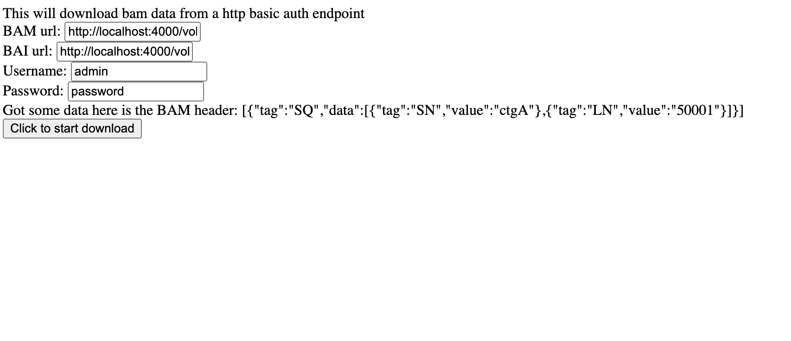

# bam_fetch_auth_file

Fetches BAM data using HTTP basic auth in the browser

If the credentials you enter in the text box are correct, it will not pop up the
browsers username/password box, and just work. See
https://stackoverflow.com/questions/9859627/how-to-prevent-browser-to-invoke-basic-auth-popup-and-handle-401-error-using-jqu
about how it's hard to prevent this default behavior

## Screenshot

If it is successful it will NOT pop up a browser username password prompt and
successfully download using the thing you typed into the in-page textboxes
